# ΠΡΟΓΡΑΜΜΑΤΙΣΜΟΣ & ΣΥΣΤΗΜΑΤΑ ΣΤΟΝ ΠΑΓΚΟΣΜΙΟ ΙΣΤΟ - ΕΡΓΑΣΤΗΡΙΑΚΗ ΑΣΚΗΣΗ ΑΚΑΔΗΜΑΪΚΟΥ ΕΤΟΥΣ 2020-21

## ΠΕΡΙΕΧΟΜΕΝΑ

- [1. Δημιουργοί](#1-δημιουργοί)
- [2. Overview](#2-overview)
- [3. Τεχνολογίες Ανάπτυξης](#3-τεχνολογίες-ανάπτυξης)
- [4. ER Διάγραμμα / Σχεσιακοί Πίνακες](#4-er-διάγραμμα--σχεσιακοί-πίνακες)

# 1. Δημιουργοί

Χρήστος Πελέκης - 1059635 - [st1059635@ceid.upatras.gr](mailto:st1059635@ceid.upatras.gr)

Κωνσταντίνος Τεπετές - 1064973 - [st1064973@ceid.upatras.gr](mailto:st1064973@ceid.upatras.gr)

# 2. Overview

Στα πλαίσια της εργαστηριακής άσκησης αναπτύξαμε το **HAR Sourcerer**, μία πλατφόρμα πληθοποριστικής συλλογής και ανάλυσης δεδομένων κίνησης HTTP, τα οποία προέρχονται από αρχεία **HAR (HTTP Archive)**.

To HAR Sourcerer παρέχει βασικές αναλύσεις των δεδομένων κάθε εγγεγραμμένου χρήστη. Οι διαχειριστές της σελίδας έχουν επιπλέον πρόσβαση σε γενικότερες αναλύσεις που αφορούν την υποδομή του διαδικτύου σε μια ευρύτερη περιοχή αλλά και σε στατιστικά που αφορούν την ιστοσελίδα.

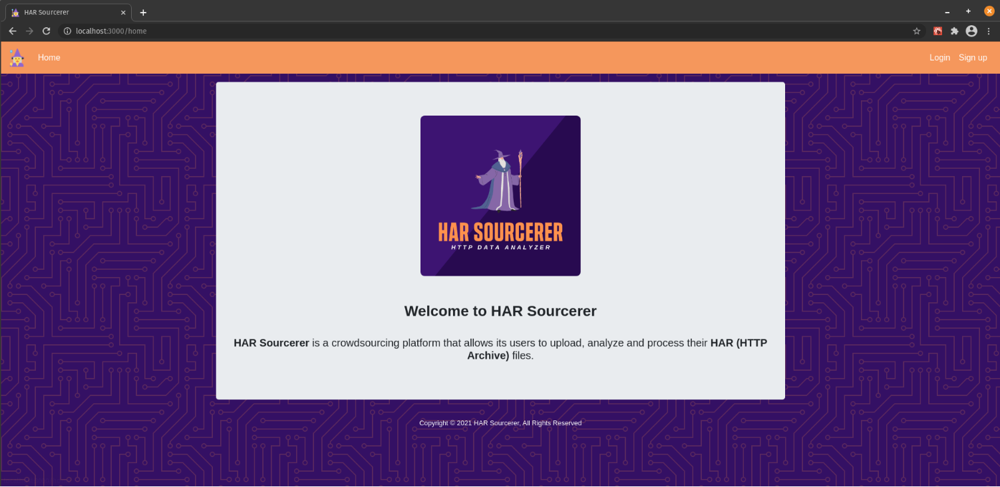

## 2.1 Register και login

Διαδικασία εγγραφής με input validation για username (έλεγχος ύπαρξης), email (έλεγχος ύπαρξης και έλεγχος έγκυρης διεύθυνσης) και password (τουλάχιστον οκτώ χαρακτήρες, τουλάχιστον ένα κεφαλαίο γράμμα, αριθμό και σύμβολο):

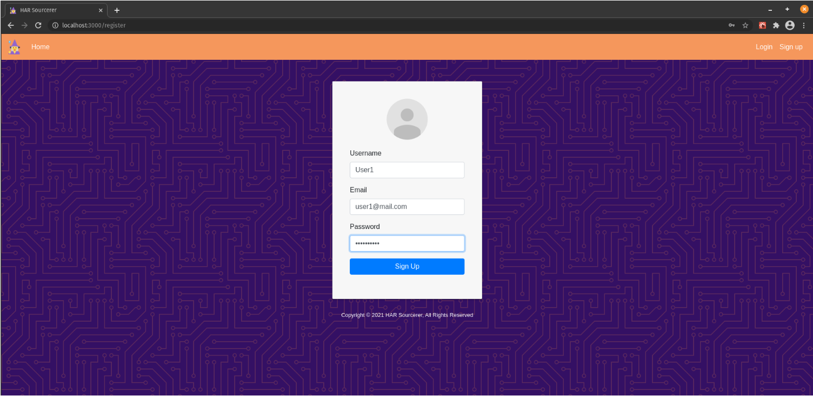

Διαδικασία σύνδεσης - αποτυχία λόγω λανθασμένου password:

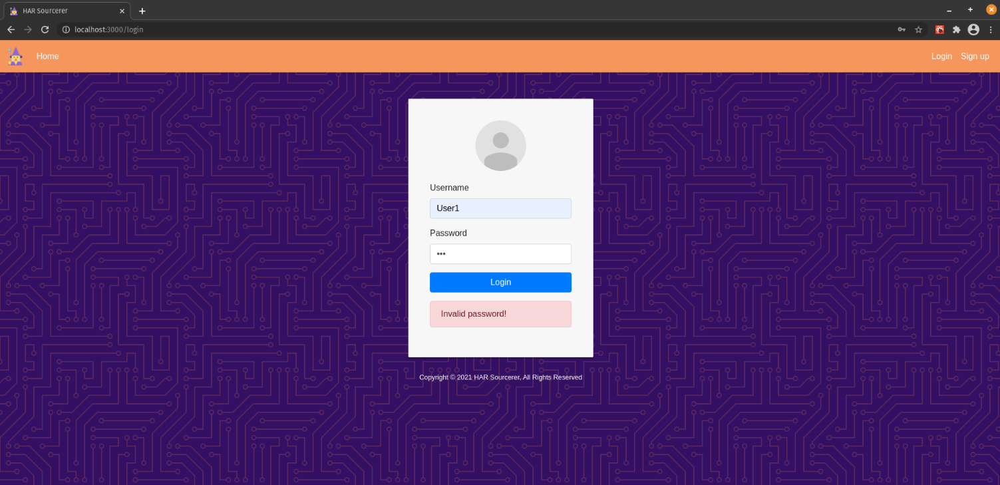

## 2.2 Landing page

Η σελίδα προσγείωσης του HAR Sourcerer παρέχει στο χρήστη πληροφορίες σχετικά με το email που χρησιμοποίησε για την εγγραφή του στη σελίδα, την ιδιότητά του στη σελίδα (απλός χρήστης ή διαχειριστής) και ένα ιστορικό των file uploads που έχει πραγματοποιήσει στην ιστοσελίδα (αριθμός εγγραφών αρχείου ανά ημερομηνία πραγματοποίησης upload):

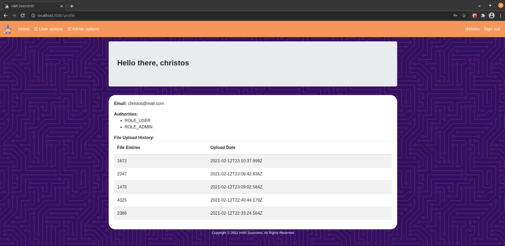

## 2.3 Navigation bar

Το navigation bar βρίσκεται στην κορυφή της σελίδας και περιλαμβάνει επιλογές για πλοήγηση στην αρχική σελίδα ("Home") και στη σελίδα προσγείωσης ("[username]") αλλά και επιλογή αποσύνδεσης ("Sign out"). Επιπλέον, περιλαμβάνει δύο μενού: ένα για τις επιλογές χρήστη ("User options", ορατό σε όλους του χρήστες της ιστοσελίδας) και ένα για τις επιλογές διαχειριστή ("Admin options", ορατό μόνο στους διαχειριστές της ιστοσελίδας). Μόνο ένα μενού μπορεί να είναι ανοικτό κάθε στιγμή:

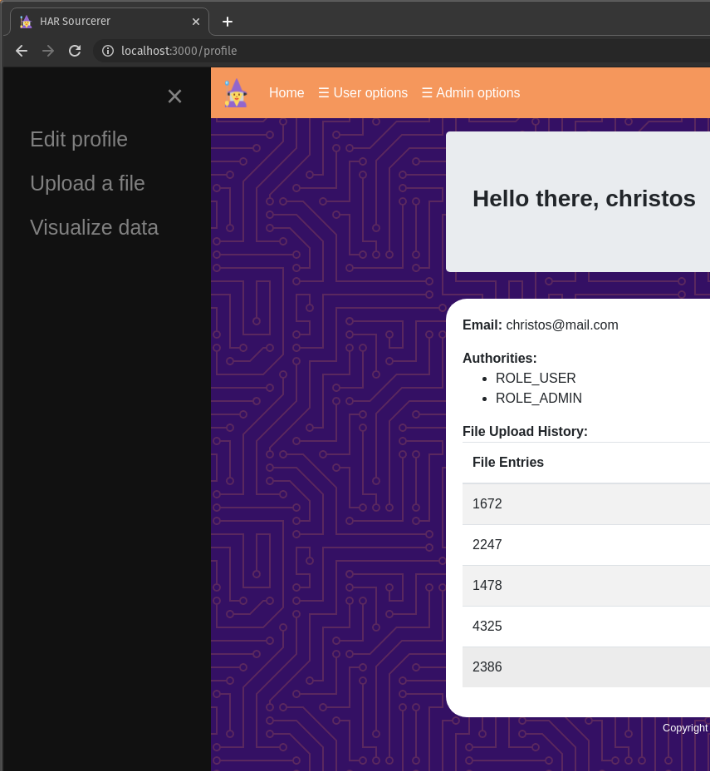

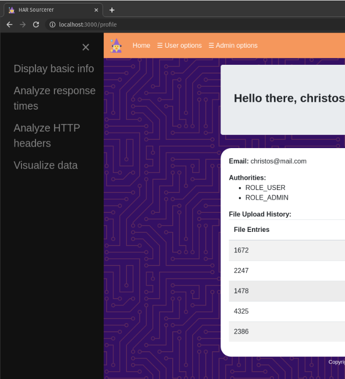

## 2.4 User options

### 2.4.1 Edit profile

Ο χρήστης μπορεί να αλλάξει το username του ή/και το password του:

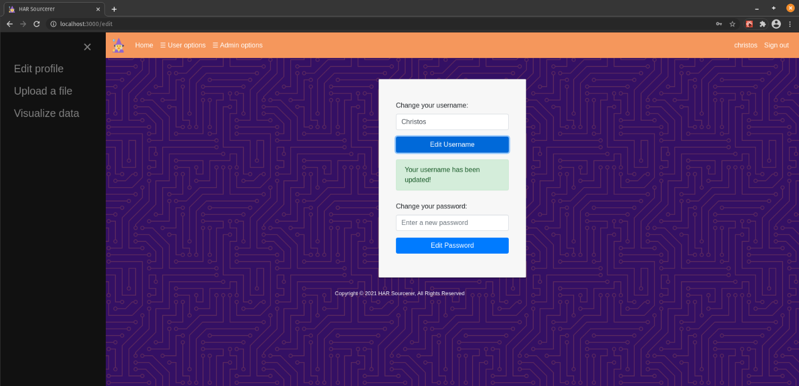

### 2.4.2 Upload a file

Ο χρήστης μπορεί να επιλέξει ένα HAR αρχείο από τον υπολογιστή του και να το αποθηκεύσει τοπικά πατώντας το "Save". Πριν την τοπική αποθήκευση, το αρχείο επεξεργάζεται κατάλληλα ώστε να αφαιρεθεί η ευαίσθητη πληροφορία. Στη συνέχεια ο χρήστης μπορεί να κατεβάσει τα επεξεργασμένα δεδομένα σε ένα JSON αρχείο πατώντας το "Export" ή/και να ανεβάσει τα επεξεργασμένα δεδομένα στον λογαριασμό του πατώντας το "Upload":

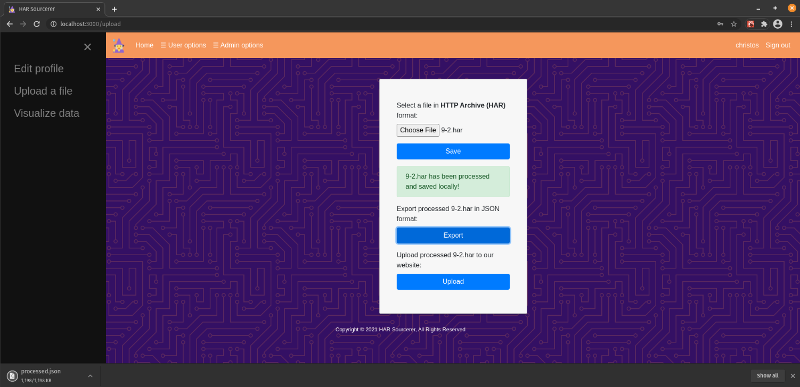

### 2.4.3 Visualize data

Ο χρήστης μπορεί να δει σε ένα χάρτη δυναμικής κλίμακας τις περιοχές στις οποίες έχει αποστείλει αιτήσεις HTTP, σύμφωνα με τις αντίστοιχες διευθύνσεις IP. Όσο πιο "καυτή" είναι μια περιοχή, τόσο περισσότερες αιτήσεις έχει στείλει ο χρήστης σε αυτή:

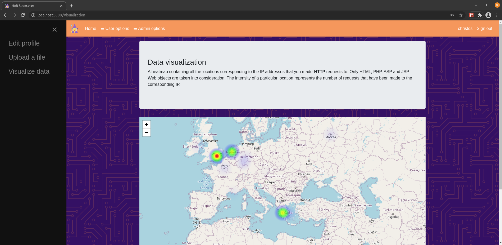

## 2.5 Admin options

<aside>
⚠️ Τα στιγμιότυπα προέρχονται από το δοκιμαστικό κύκλο ανάπτυξης της ιστοσελίδας. Συνεπώς, τα στατιστικά που απεικονίζονται παρακάτω είναι ενδεικτικά. Προφανώς, θα πραγματοποιηθεί εμπλουτισμός της βάσης δεδομένων σύμφωνα με την εκφώνηση της εργασίας.

</aside>

### 2.5.1 Display basic info

Ο διαχειριστής μπορεί να δει βασικά στατιστικά που αφορούν την ιστοσελίδα (αριθμό χρηστών, μοναδικά domains και πάροχους συνδεσιμότητας). Μπορεί επίσης να δει το πλήθος των εγγραφών ανά μέθοδο HTTP αίτησης…

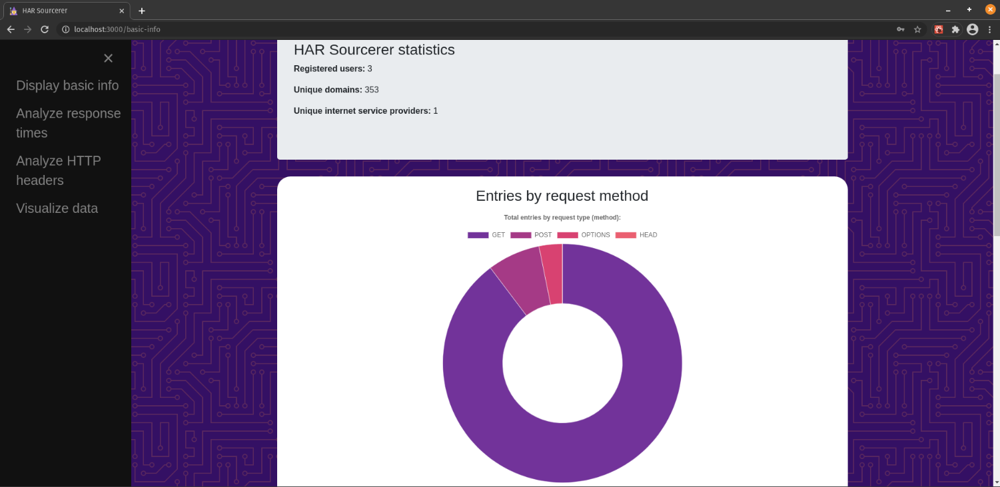

...το πλήθος των εγγραφών ανά status HTTP απόκρισης και…

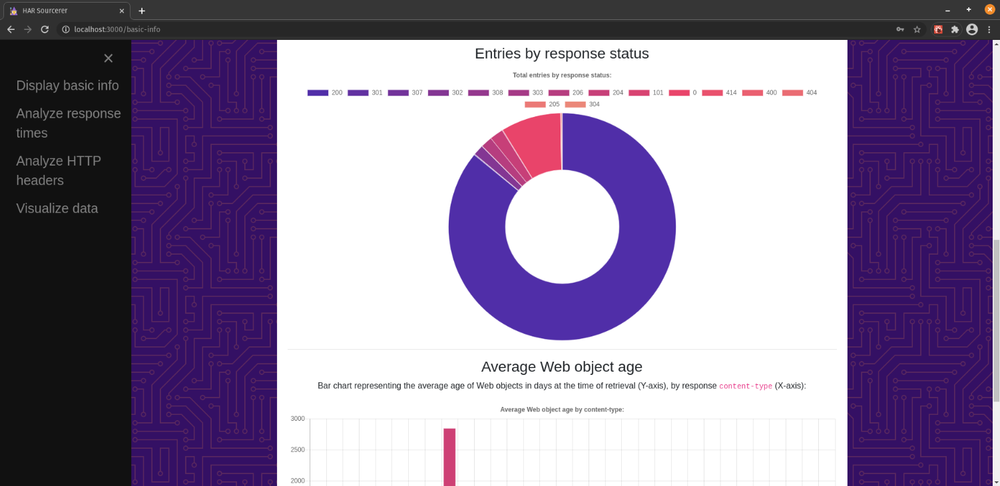

…τη μέση ηλικία ιστοαντικειμένων ανά `content-type`.

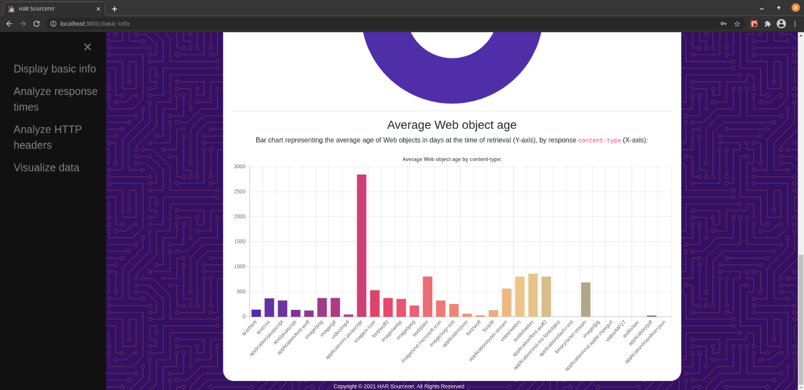

### 2.5.2 Analyze response times

Ο διαχειριστής μπορεί να δει το μέσο χρόνο απόκρισης σε HTTP αιτήσεις ανά ώρα της ημέρας:

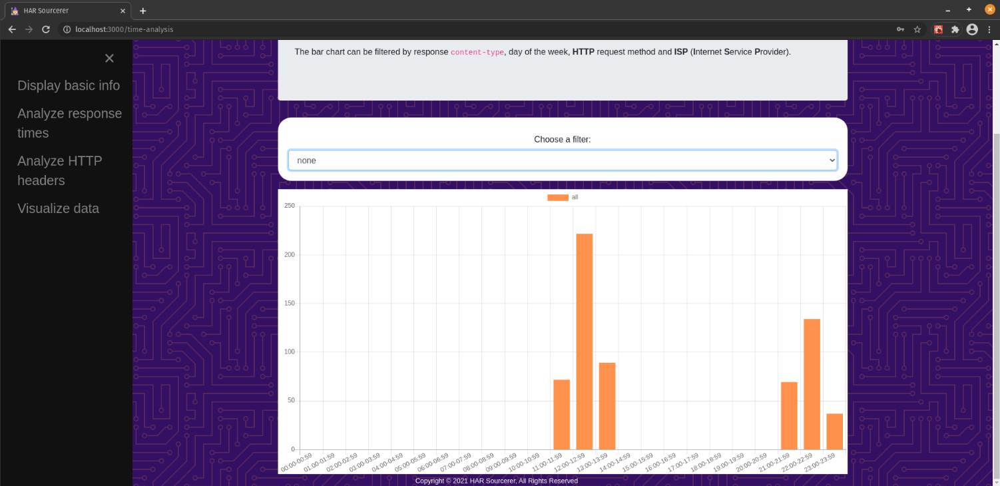

Το bar chart μπορεί να φιλτραριστεί ανάλογα με το `content-type`, την ημέρα της εβδομάδας (επιλεγμένο φίλτρο στο στιγμιότυπο), τη μέθοδο της αντίστοιχης HTTP αίτησης και τον πάροχο συνδεσιμότητας:

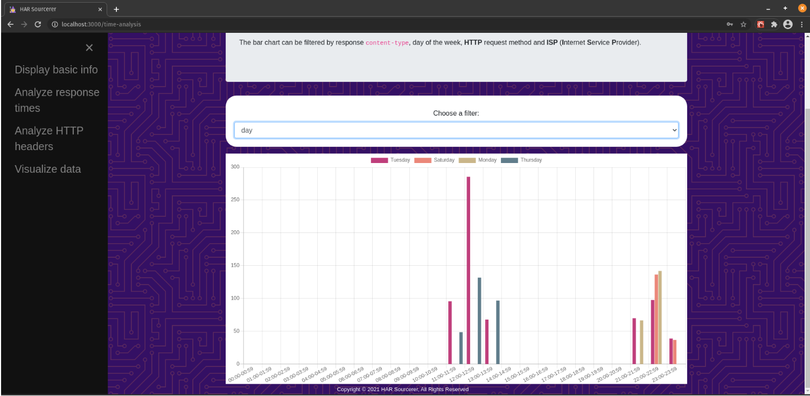

### 2.5.3 Analyze HTTP headers

Ο διαχειριστής μπορεί να δει στοιχεία που αφορούν τη χρήση κρυφών μνημών, είτε για το σύνολο των ανεβασμένων εγγραφών στην ιστοσελίδα, είτε για τις εγγραφές που αφορούν κάποιο συγκεκριμένο πάροχο συνδεσιμότητας. Ειδικότερα, μπορεί να δει ένα ιστόγραμμα κατανομής των ιστοαντικειμένων στην απόκριση ανά `content-type`…

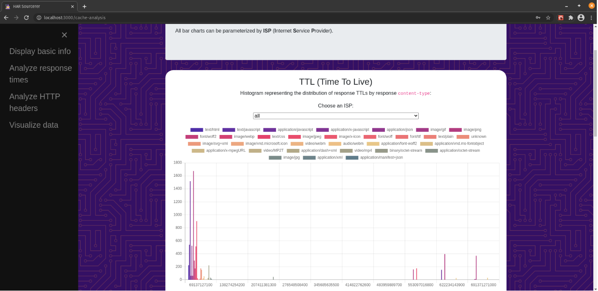

…bar chart όπου απεικονίζεται το ποσοστό `max-stale` και `min-fresh` directives επί του συνόλου των αποκρίσεων ανά `content-type` (**δυστυχώς δεν εντοπίστηκε κανένα από τα δύο directives σε περισσότερα από 20,000 entries**) και…

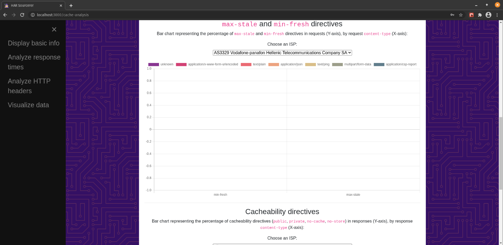

...bar chart όπου απεικονίζεται το ποσοστό τεσσάρων cacheability directives επί του συνόλου των αποκρίσεων ανά `content-type`:

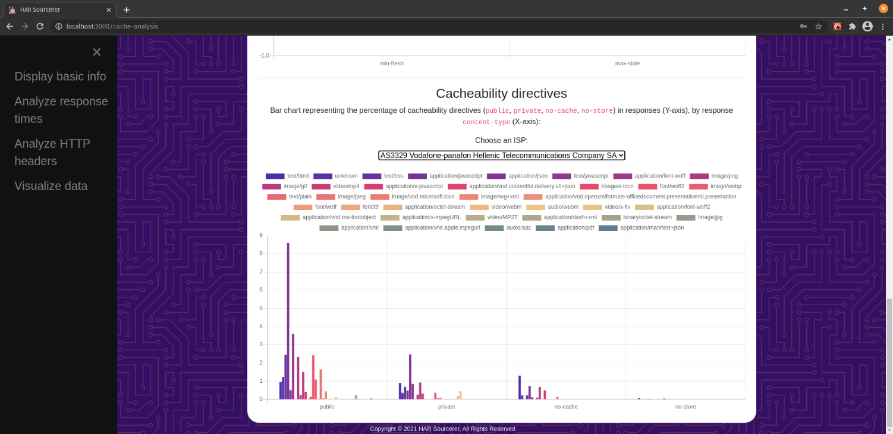

### 2.5.4 Visualize data

Ο διαχειριστής μπορεί να δει σε ένα χάρτη δυναμικής κλίμακας τις διαδρομές των HTTP αιτήσεων με τη μορφή βελών. Το πάχος κάθε βέλους είναι ανάλογο του αριθμού πραγματοποίησης ίδιων διαδρομών:

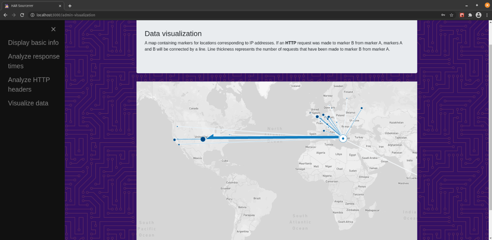

# 3. Τεχνολογίες ανάπτυξης

Τo HAR Sourcerer αναπτύχθηκε με πρότυπο τη στοίβα MERN (MongoDB, Express, React, Node):

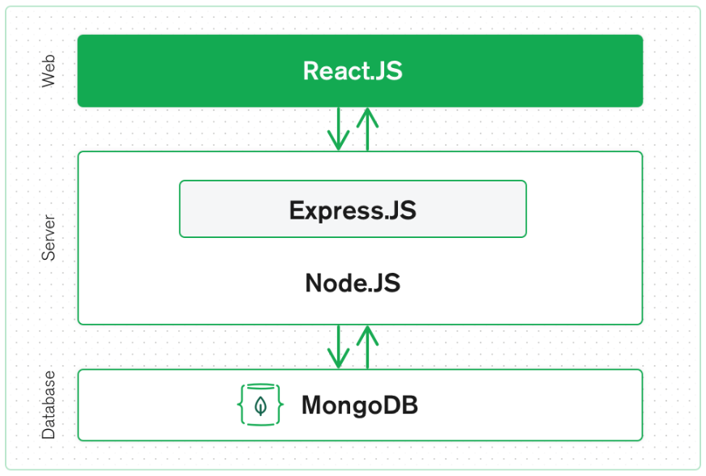

Με λίγα λόγια, χρησιμοποιείται η document database MongoDB, η οποία προτιμήθηκε σε σύγκριση με κλασικές σχεσιακές βάσεις δεδομένων όπως MySQL, λόγω της φύσης των δεδομένων που θα έπρεπε να διαχειριστεί η ιστοσελίδα (JSON format). Η βάση μας φιλοξενείται σε cluster του Atlas cloud service.

Στον client χρησιμοποιήθηκε το React, ένα front-end framework που οργανώνει HTML και JavaScript σε components για καλύτερη διαχείριση ενός project μεγάλης κλίμακας όπως το HAR Sourcerer.

To back-end της ιστοσελίδας έχει υλοποιηθεί σε Node, ένα run-time environment που επιτρέπει την εκτέλεση JavaScript κώδικα εκτός φυλλομετρητή. Για τη δημιουργία του web server μας χρησιμοποιήθηκε το Express framework του Node.

Πέρα από τις τεχνολογίες της στοίβας χρησιμοποιήθηκαν και αρκετές βιβλιοθήκες για την υλοποίηση αρκετών λειτουργιών της ιστοσελίδας και τη διευκόλυνση ανάπτυξης κώδικα. Τα σημαντικότερα:

**Client:**

- `axios` : για εύκολη αποστολή promise-based HTTP αιτήσεων στο server και αποδοχή εισερχόμενων HTTP αποκρίσεων.
- `bootstrap` : για responsiveness και χρήσιμες κλάσεις HTML στοιχείων.
- `chart.js` : για τα σχήματα (bar charts, doughnuts) στις επιλογές χρήστη και διαχειριστή.
- `deck.gl` : για το χάρτη στην οπτικοποίηση δεδομένων του διαχειριστή.
- `javascript-color-gradient` : για το custom colorway στα σχήματα της ιστοσελίδας.
- `leaflet-heatmap` : για το χάρτη στην οπτικοποίηση δεδομένων του χρήστη.
- `react-router-dom` : για τη δρομολόγηση της ιστοσελίδας.
- `validator` : για username, email και password validation κατά την εγγραφή χρήστη στο σύστημα.
- `underscore` : για ορισμένες χρήσιμες συναρτήσεις.

**Server:**

- `axios` : για εύκολη αποστολή promise-based HTTP αιτήσεων στον client και αποδοχή εισερχόμενων HTTP αποκρίσεων.
- `bcryptjs` : για κρυπτογράφηση του κωδικού των χρηστών.
- `body-parser` : για την επεξεργασία του σώματος μιας αίτησης σε middleware.
- `cors` : για την υλοποίηση Cross-Origin Resource Sharing.
- `jsonwebtoken` : σημαντικό για την υλοποίηση του user authentication.
- `lodash` και `underscore` : για ορισμένες χρήσιμες συναρτήσεις.
- `mongoose` : για διαχείριση της βάσης δεδομένων και τη δημιουργία queries.

# 4. ER Διάγραμμα / Σχεσιακοί Πίνακες

Εφόσον υλοποιήσαμε τη βάση δεδομένων μας με NoSQL database MongoDB δεν είναι δυνατή η αναπαράσταση υπό τη μορφή Σχεσιακών Πινάκων και Διαγραμμάτων ER. Ωστόσο, αν δεν την υλοποιούσαμε με Non-Relational Database ο σχεδιασμός της βάσης μας θα γινόταν με βάση τα εξής:

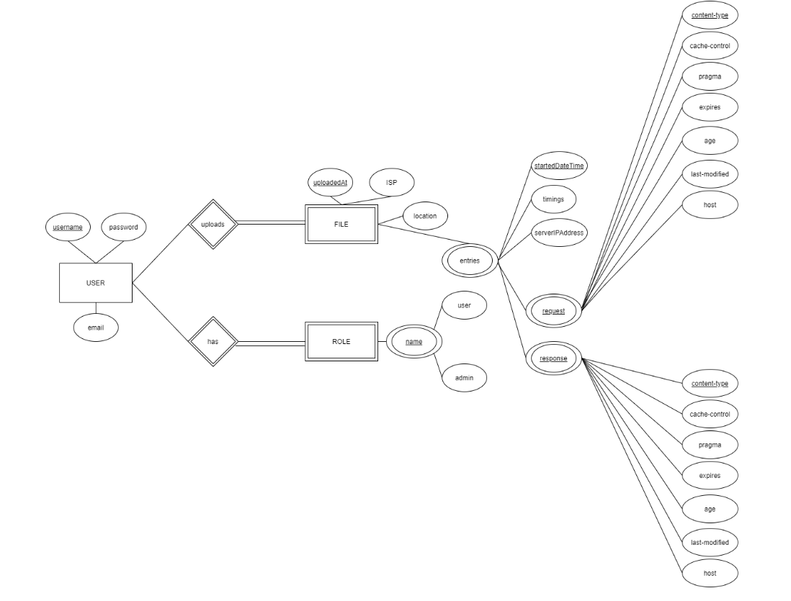

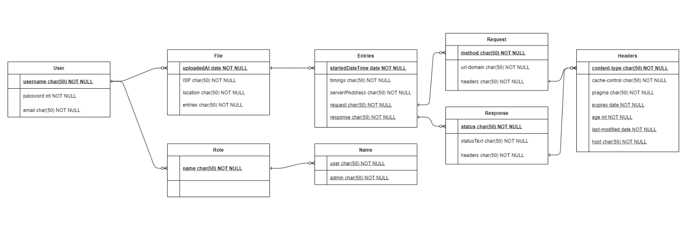
